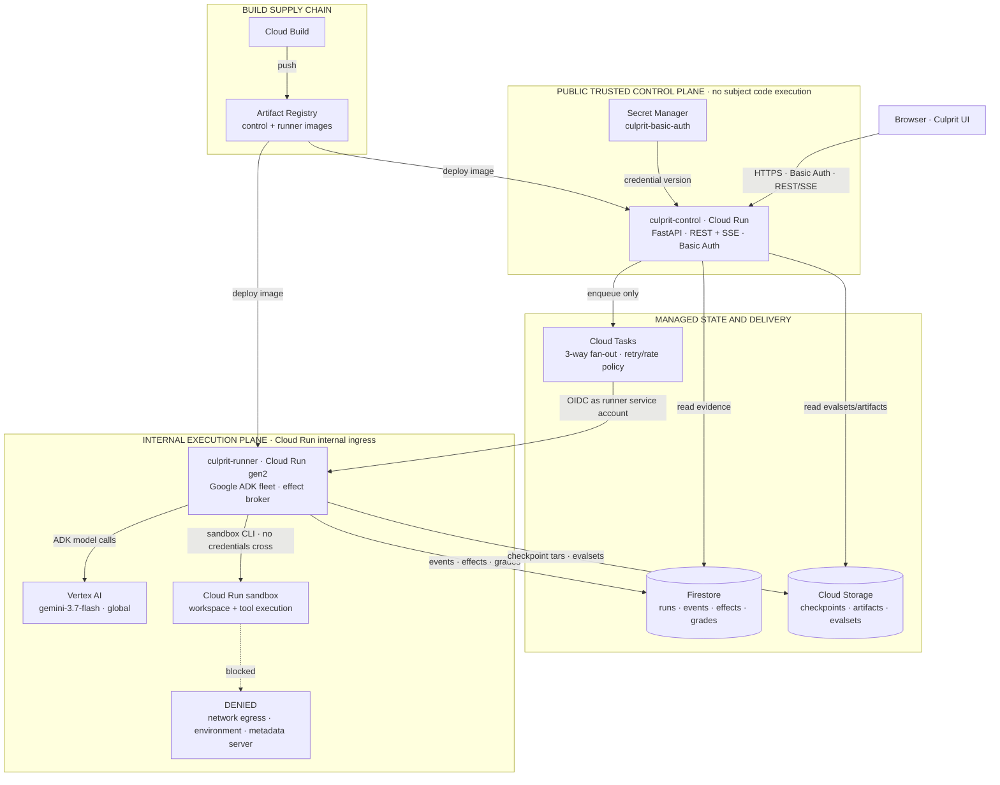

# Architecture

Culprit has two Cloud Run services separated by a hard trust boundary. The public control service
can read evidence and enqueue work, but it contains no sandbox driver and never executes subject
code. The internal runner holds the ADK agent process and drives credential-free Cloud Run
sandboxes. A detached sandbox remains local to one runner instance, so each run or branch finishes
inside one request.

The same diagram is committed as [a rendered SVG](architecture.svg) for viewers that do not render
Mermaid.

## Trust boundary

| Surface | Reachable from | Authority | Explicitly cannot do |
|---|---|---|---|
| `culprit-control` | Public internet after application Basic Auth | Read Firestore/GCS, read its auth secret, enqueue Cloud Tasks | Import the sandbox driver, launch a sandbox, or execute subject code |
| `culprit-runner` | Internal Cloud Run ingress through Cloud Tasks OIDC | Call Vertex AI, persist evidence, drive local sandboxes | Accept an unauthenticated public request |
| Cloud Run sandbox | Runner's sandbox CLI only | Read/write its imported ephemeral workspace and run allowed tools | Reach the network, inherit host environment variables, query the metadata server, or receive cloud credentials |

The effect broker runs in the runner host, not inside the sandbox. All MVP effects are
`simulate`/`replay`; there is no real sender or payment executor.

